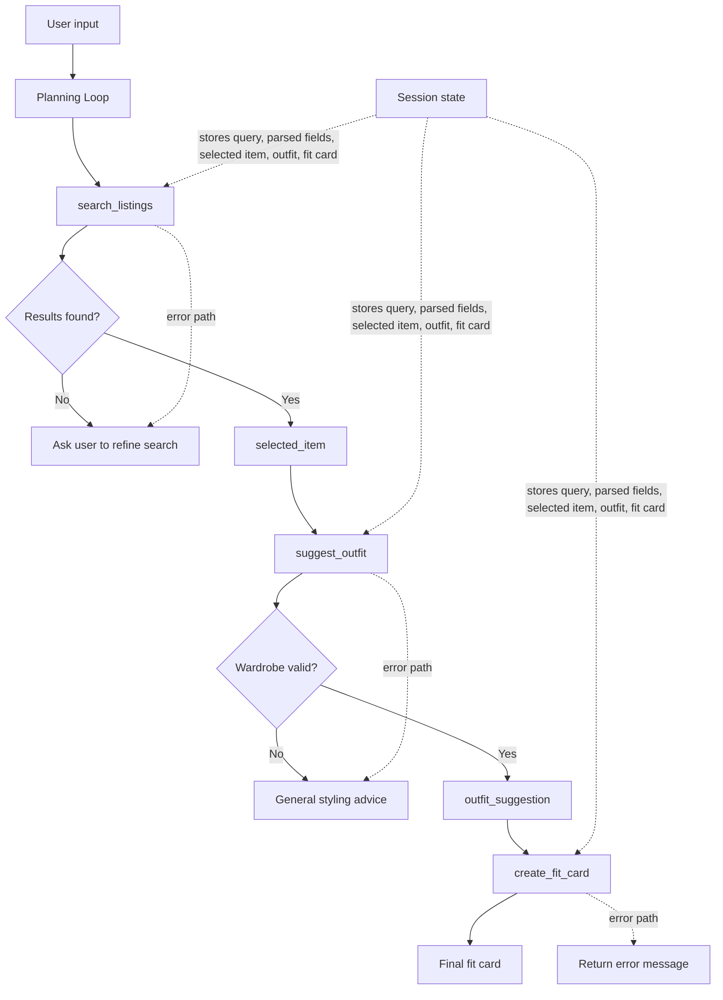

# FitFindr — planning.md

> Complete this document before writing any implementation code.
> Your spec and agent diagram are what you'll use to direct AI tools (Claude, Copilot, etc.) to generate your implementation — the more specific they are, the more useful the generated code will be.

> Your planning.md will be reviewed as part of your submission.
> Update it before starting any stretch features.

---

## Tools

List every tool your agent will use. For each tool, fill in all four fields.
You must have at least 3 tools. The three required tools are listed — add any additional tools below them.

### Tool 1: search_listings

**What it does:**
This tool searches the data set and returns a list of possible clothing items that match description, size,and pricing
**Input parameters:**
<!-- List each parameter, its type, and what it represents -->
- `description` (str): A text description of the item the user wants, such as "vintage graphic tee" or "black denim jacket". This is the main search term used to find relevant listings.

- `size` (str): The user’s clothing size, such as S, M, or L. This narrows the search to listings that match that size provided.

- `max_price` (float): The maximum amount the user is willing to spend, such as 25.0 or 40.99. Listings above this price must be excluded from the results.
**What it returns:**
It will return a list of matching listings from the data set sorted from most relevant to least relevant matches.

**What happens if it fails or returns nothing:**
If it fails or returns nothing the agent should state 'No listings were found according to your requirements, would you like to search for something elese?'

---

### Tool 2: suggest_outfit

**What it does:**
The tool suggest possible outfits based on what is already in the woardroab of the user. The agent will do this based on similar style tags and will match the listed item with what ever other parts of the outfit is missing. For example if the listing is a shirt they should match it with bottoms, shoes and accesories.

**Input parameters:**
<!-- List each parameter, its type, and what it represents -->

- `new_item` (dict): The thrifted item the user is considering buying, such as a listing dictionary returned by `search_listings()`. It includes fields like `title`, `description`, `category`, `price`, `size`, and `style_tags`.

- `wardrobe` (dict): The user’s current wardrobe, stored in a dictionary with an `items` key. This contains the clothing items already in their closet that the agent can use to build outfit suggestions.
**What it returns:**
It returns a text-based outfit suggestion as a single string. The string describes 1–2 concise outfit options that combine the selected item with pieces from the wardrobe or general styling advice if the wardrobe is empty. It must not repeat a category; boots, sneakers, and other footwear all count as the `shoes` category.

**What happens if it fails or returns nothing:**
There are no outfits in your wardrobe that match this item.

---

### Tool 3: create_fit_card

**What it does:**
Generates a short, calm Instagram-like caption about the new listing item. The caption should be different between requests and should not describe the full outfit.

**Input parameters:**

<!-- List each parameter, its type, and what it represents -->
- `outfit` (str): The outfit suggestion text returned by `suggest_outfit()`. It contains the styling recommendation that the fit card should caption.
  
- `new_item` (dict): The thrifted item being featured, usually the selected listing from `search_listings()`. It includes details like the item name, price, brand, and platform.

**What it returns:**
It returns a one-sentence caption as a string, designed to look like a calm social media post about the thrifted item. It mentions only the new listing item, not the outfit, price, or platform.

**What happens if it fails or returns nothing:**
If the outfit input is empty, missing or incomplete the tool should return an error message such as 'Unable to generate fit card because the outfit suggestion is missing or incomplete'.

---

### Tool 4: compare_prices

**What it does:**
This tool compares a selected thrifted item against similar listings in the dataset to estimate whether the price is fair, overpriced, or a good deal.

**Input parameters:**
- `item` (dict): The item the user is considering purchasing, including its title, category, style tags, size, and current price.
- `listings` (list[dict]): A list of other listings from the dataset to compare against, typically filtered by category and style similarity.

**What it returns:**
It returns a dictionary with the selected item’s price, the average price of similar items, the price difference, and a brief recommendation such as “fair value,” “slightly high,” or “good deal.”

**What happens if it fails or returns nothing:**
If the selected item is missing, the tool should return a short error message such as: "Unable to compare prices because the item data is missing or incomplete."
---

## Planning Loop

**How does your agent decide which tool to call next?**
The planning loop  extracts the user’s item description, preferred size, and budget from their request. It then calls `search_listings` with those values to find relevant listings. If no listings match, it asks the user for a different search. If listings are found, it selects the most relevant item and passes it to `suggest_outfit` along with the wardrobe. If the wardrobe is empty or no outfit can be suggested, the agent gives general styling advice instead. After a valid outfit is generated, it calls `create_fit_card` to turn the suggestion into a final caption. The loop ends once it has a valid fit card or a clear fallback response for an empty or failed state.
---

## State Management

**How does information from one tool get passed to the next?**
The agent keeps a session state object that stores the user’s query, the parsed search fields, the selected item, the outfit suggestion, and the final fit card. After `search_listings` returns matching listings, the agent chooses the most relevant item and stores it as the current `selected_item`. That item is then passed into `suggest_outfit` alongside the wardrobe. The resulting outfit text is saved as `outfit_suggestion`, and it is then passed into `create_fit_card` together with the same item to generate the final caption. This session state allows each tool to use the output of the previous tool without re-running earlier steps.
---

## Error Handling

For each tool, describe the specific failure mode you're handling and what the agent does in response.

| Tool | Failure mode | Agent response |
|------|-------------|----------------|
| search_listings | No results match the query |"No listing matched your descrption. Would you like to search for something else? |
| suggest_outfit | Wardrobe is empty | 'Outfit could not be made with this listing, would you like to search for another listing?'|
| create_fit_card | Outfit input is missing or incomplete | 'Outfit input is either missing or not complete, fit card could not be generated.' |

---

## Architecture

---

## AI Tool Plan

<!-- For each part of the implementation below, describe:
     - Which AI tool you plan to use (Claude, Copilot, ChatGPT, etc.)
     - What you'll give it as input (which sections of this planning.md, your agent diagram)
     - What you expect it to produce
     - How you'll verify the output matches your spec before moving on

     "I'll use AI to help me code" is not a plan.
     "I'll give Claude my Tool 1 spec (inputs, return value, failure mode) and ask it to implement
     search_listings() using load_listings() from the data loader — then test it against 3 queries
     before trusting it" is a plan. -->

**Milestone 3 — Individual tool implementations:**

I will be using Copilot.

For 'search_listings' I will give the model the tool specifications from the planning.md including the parameters such as `description`, `size`, and `max_price`, the expected return type (`list[dict]`), and the failure behavior when there is no listings match. The expected returm is a python function that loads the dataset, filters by size and prce, scores listings by keyword overlap with description, removes zero-score matches and returns the most relevant result. This will be tested with at least three example searches: a direct match, a filtered result under budget and a no-match case confirming it returns a list or an empty list as expected.

For 'suggest_outfit' I will give the agent the 'new_item' and wardrobe specs, as well as the wardrobe schema and the expected result when the wardrobe is empty. The expected result is a function that checks whether the wardrobe is empty, then either provides general styling advice or builds an outfit suggestion using the item and wardrobe contents. To verify this I will run it with an empty wardrobe and then with a sample wardrobe to confirm ir returns a non-empty string in both cases, without raising errors.

For the 'create_fit_card' I will give the model the 'outfit' and 'new_item' input specs, plus the required social media style (calm, one sentence, item-only, natural tone) and different wordings across runs. The expected output is a function that validates the outfit input, builds a prompt from the item name and outfit text, and returns a short fit card caption. I will test it with valid outfit text and with missing/empty outfit text to confirm it returns either a proper caption or a descriptive error string.

I would give the model the tool specifications including 'item' and 'listings' inputs, the expected return type ('dict') and the failure condition when the item is missing or incomplete. The expected output is a python function that compares the selected item's price with similar listings in the dataset, calculates the average market price, identifies whether the item is a good deal and returns a dictionary with the price comparison information. To verify this I would test the function with a valid item, a matching category and missing item to confirm it returns a comparison result or an error message as expected.

**Milestone 4 — Planning loop and state management:**
I will be using copilot

2. Input: I will provide the full planning specification, the tool return contracts, the architecture diagram, and the state flow description.
3. Expected output: A planning loop that:
   - parses the user request,
   - calls 'search_listings',
   - stores the best item in session state,
   - passes that item to 'suggest_outfit'
   - stores the outfit suggestion,
   - passes both the outfit and the item into 'create_fit_card',
   - returns the final caption or a fallback response on error.
THI will check that the state object carries values from one tool to the next and that each tool handles failure cases without crashing.
---

## A Complete Interaction (Step by Step)

Write out what a full user interaction looks like from start to finish — tool call by tool call. Use a specific example query.

**Example user query:** 
'Could you find me a nice vintage hoodie under $50 dollars?'
**Step 1:**
<!-- What does the agent do first? Which tool is called? With what input? -->
The agent begins by parsing the request and calling to search_listing tool considering the description="vintage hoodie" and the max_price=50. The agent then searches the dataset for the best hoodie matches under budget. If the listings are found the agent picks the most relevant one, and then stores the selected item. 
**Step 2:**
<!-- What happens next? What was returned from step 1? What tool is called now? -->

The agent responds with: 
Listing: Vintage Graphic Hoodie — Faded Black
Agent: Ask for an outfit next, then a fit card.

It then calls on the suggest_outfit tool using that item plus the user’s wardrobe. 

**Step 3:**
<!-- Continue until the full interaction is complete -->
The agent then responds with: 

Outfit: Vintage Graphic Hoodie — Faded Black pairs really well with Black combat boots and Black crossbody bag. Add Vintage black denim jacket to keep the styling easy and intentional.

The agent then calls on the create_fit_card tool to turn that styling idea into a short caption that varies for each new outfit. 

**Final output to user:**
<!-- What does the user actually see at the end? -->
In this case the fit card was:

Vintage Graphic Hoodie — Faded Black feels like an easy favorite.

The final result is a listing, an outfit suggestion, and a fit-card caption. The user does not recieve this full list unless they prompt for one after the other.
